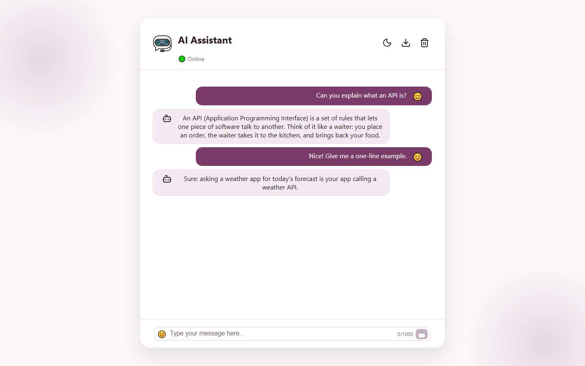

# AI Chatbot (full-stack)

A conversational AI assistant with a React front end and an Express back end that keeps the Gemini API
key private. This is **Stage 1**: a secure back end, a faithful React port of the original UI, and
the basics done properly (validation, rate limiting, tests).

<!-- Screenshot placeholder: replace with a real capture, e.g. docs/screenshots/new-1440-light-chat.png -->



## Features

- Chat with Google Gemini, with real conversation memory (the last 10 messages are sent each time)
- Light and dark themes, sound effects, "AI is thinking" indicator, live character counter
- Enter to send, Shift+Enter for a new line
- Welcome block with starter-question chips; it hides after the first message and returns after clearing
- Clear chat and export the conversation as a `.txt` file
- Chat is saved in `localStorage` (capped at 50 messages, read defensively)
- Friendly error messages, with failed messages never left in the conversation context
- Responsive layout, `100dvh` for mobile browser bars, visible focus styles, `prefers-reduced-motion` respected

## Stack

| Part   | Tech                                                              |
| ------ | ----------------------------------------------------------------- |
| Client | React 19, Vite, lucide-react                                      |
| Server | Node.js, Express 5, `@google/genai`, `express-rate-limit`, `cors` |
| Tests  | Vitest + Supertest (the Gemini call is mocked)                    |
| Tools  | ESLint 9, Prettier                                                |

All dependency versions are pinned exactly.

## Setup

Requires Node.js 20+.

```bash
# 1. Install dependencies
npm install
npm --prefix server install
npm --prefix client install
```

2. **Create your own `.env`.** Copy `server/.env.example` to `server/.env` and fill it in. Never commit this
   file (it is git-ignored).

   ```
   GEMINI_API_KEY=<your key from https://aistudio.google.com/apikey>
   GEMINI_MODEL=gemini-3.8-flash
   GEMINI_FALLBACK_MODEL=gemini-3.5-flash-lite
   PORT=3001
   ```

   | Variable                | Required | Purpose                                                                           |
   | ----------------------- | -------- | --------------------------------------------------------------------------------- |
   | `GEMINI_API_KEY`        | yes      | Your Gemini API key. Stays on the server.                                         |
   | `GEMINI_MODEL`          | yes      | Main model. Check the [models page](https://ai.google.dev/gemini-api/docs/models) |
   | `GEMINI_FALLBACK_MODEL` | no       | Used when the main model is overloaded or over quota (recommended)                |
   | `GEMINI_TIMEOUT_MS`     | no       | How long to wait for Gemini, default `30000`                                      |
   | `CLIENT_ORIGIN`         | no       | Website origin(s) allowed to call the API, comma-separated. Default: localhost    |
   | `PORT`                  | no       | Default `3001`. Hosts such as Render set it for you                               |

   The client has one optional setting, `VITE_API_URL` (see `client/.env.example`). Leave it empty locally.

3. **Run the two servers** in separate terminals:

   ```bash
   npm run dev:server   # http://localhost:3001
   npm run dev:client   # http://localhost:5173 (proxies /api to the server)
   ```

### Other scripts

```bash
npm test               # server tests (validation, rate limit, error mapping)
npm run lint           # ESLint
npm run format         # Prettier
npm run build          # production build of the client
```

## Architecture

```
Browser (React)  --POST /api/chat-->  Express  --generateContent-->  Gemini
   localStorage                       validation, rate limit, CORS     (key lives only here)
```

- The browser never sees the API key. It only talks to `/api/chat`.
- `POST /api/chat` accepts `{ messages: [{ role: "user" | "assistant", content: string }] }`.
  - Max 20 messages; roles must alternate, start with `user` and end with `user`
    (so a valid history always has an odd length, at most 19).
  - Length limits: `user` messages up to 1000 characters, `assistant` messages up to 8000, and at most
    40000 characters across the whole request.
  - Rate limit: 20 requests per 15 minutes per visitor IP (the server trusts one proxy hop, so this also holds
    behind Render). CORS is limited to `CLIENT_ORIGIN`. JSON body limit 256 KB.
- `GET /api/health` returns `{ "status": "ok" }` for uptime checks. It never calls Gemini.
  - Errors are mapped to friendly messages (busy, misconfigured, unreachable, model unavailable);
    internal details are only logged on the server.
- The client sends the last 10 messages, trimmed to begin with a user turn (so usually 9 or 10) and
  to fit the server's size limits. Replies are never shortened on screen or in storage; only an assistant
  reply over 8000 characters is clamped in the outgoing history so follow-ups keep working.
  If a request fails, the message is removed from the context and put back in the input box.
- Rendering is plain text for now.

```
client/src/
  components/   Header, Welcome, MessageList, ThinkingStatus, ChatInput
  hooks/        useChat (state, requests, rollback), useTheme
  lib/          api (API base URL), chat (context building, sanitising), storage, sounds, exportChat
server/
  app.js        Express app (validation, CORS, rate limit, health check, error mapping)
  index.js      loads env, creates the Gemini client, starts the server
  app.test.js   tests
  .env.example  all server settings, placeholders only
```

## Deployment

The website goes on **Vercel** and the API on **Render**. Deploy the API first, because the website needs its URL.
Use a new GitHub repository for this project, and never commit a `.env` file: the Gemini key is entered only in
Render's dashboard.

### 1. API on Render

Create a **Web Service** from your GitHub repository, then use these settings:

| Setting           | Value                                                |
| ----------------- | ---------------------------------------------------- |
| Root Directory    | `server`                                             |
| Runtime           | Node (the `engines` field asks for Node 20 or newer) |
| Build Command     | `npm install`                                        |
| Start Command     | `npm start`                                          |
| Health Check Path | `/api/health`                                        |
| Instance Type     | Free is fine to start                                |

Add these under **Environment**. Do not set `PORT`; Render sets it.

| Variable                | Value                                                                   |
| ----------------------- | ----------------------------------------------------------------------- |
| `GEMINI_API_KEY`        | your key from [AI Studio](https://aistudio.google.com/apikey)           |
| `GEMINI_MODEL`          | for example `gemini-3.8-flash`                                          |
| `GEMINI_FALLBACK_MODEL` | optional, for example `gemini-3.5-flash-lite`                           |
| `GEMINI_TIMEOUT_MS`     | optional, default `30000`                                               |
| `CLIENT_ORIGIN`         | your Vercel URL, for example `https://your-app.vercel.app` (see step 3) |

When it is live, open `https://YOUR-SERVICE.onrender.com/api/health`. It should show `{"status":"ok"}`.

### 2. Website on Vercel

Import the same repository as a **Project**, then:

| Setting          | Value                     |
| ---------------- | ------------------------- |
| Root Directory   | `client`                  |
| Framework Preset | Vite                      |
| Build Command    | `npm run build` (default) |
| Output Directory | `dist` (default)          |

Add one environment variable: `VITE_API_URL` = `https://YOUR-SERVICE.onrender.com` (the Render URL, no trailing
slash). It is public and baked in at build time, so **redeploy after changing it**. No `vercel.json` is needed:
the app is a single page with no client-side routes.

### 3. Connect them

Copy your Vercel URL into `CLIENT_ORIGIN` on Render (several origins can be separated by commas, with no trailing
slash) and let Render redeploy. Every address the site is opened from must be listed: a custom domain, or a Vercel
preview URL, is blocked by CORS until you add it.

### Good to know

- **Free Render services sleep after about 15 minutes without traffic.** The first request after that can take up
  to a minute while the service wakes up. The app shows "AI is thinking" and, if it gives up waiting, a message
  saying the server may still be waking up.
- A public site lets anyone spend your Gemini quota. The server limits each visitor to 20 messages per 15 minutes,
  but watch your usage in AI Studio.
- Rate limiting assumes exactly one proxy in front of the server, which is how Render works. If you put another
  proxy or CDN in front of it, change `trust proxy` in `server/app.js`.
- `VITE_` variables are public. Never put a key in them.

## Troubleshooting

- **"blocked by CORS policy" in the browser console:** `CLIENT_ORIGIN` on Render does not exactly match the address of
  the website (scheme and host, no path). Fix it and redeploy.
- **The website calls `/api/chat` on its own address and gets a 404:** `VITE_API_URL` was empty when Vercel built the
  site. Set it and redeploy.

The server prints the real reason for every Gemini failure in its terminal (the API key is always shown as
`[REDACTED]`). The browser receives a friendly message and a matching status code:

| Status | Meaning                                              | What to do                                                       |
| ------ | ---------------------------------------------------- | ---------------------------------------------------------------- |
| 401    | Gemini rejected the API key (it reports this as 400) | Check `GEMINI_API_KEY` in `server/.env`, then restart the server |
| 404    | `GEMINI_MODEL` does not exist                        | Fix the model name in `server/.env`, then restart the server     |
| 429    | Gemini quota or per-minute limit reached             | Wait a minute; free tiers have low limits (or set a fallback)    |
| 503    | Gemini is overloaded ("high demand")                 | Retried once, then the fallback model is used if you set one     |

The server reads `server/.env` only at startup, so restart it after changing the file. Retries only happen for
temporary overloads (500, 503, 504), and each retry counts toward your Gemini rate limit.

### A 502 with no message at all

Errors from Gemini always arrive with a message. A bare `502` (empty response body) is different: it comes from the
Vite dev proxy and means **nothing was answering on port 3001** at that moment. The app then shows "The chat server
isn't responding", and the Vite terminal prints `http proxy error: /api/chat` with the reason
(`ECONNREFUSED` = server not running, `ECONNRESET` = it stopped mid-request). Common causes:

- The server was stopped, crashed, or its terminal was closed. Start it again.
- `npm run dev:server` restarts the server whenever a file in `server/` changes, so a request sent during that
  second fails. Use `npm run start:server` instead if you want a server that never restarts by itself.
- An older copy of the server is still running (on Windows two copies can share a port without any error) and
  answers with its old code. The server now refuses to start if the port is taken; stop the old one with:

  ```powershell
  Get-NetTCPConnection -LocalPort 3001 -State Listen | ForEach-Object { Stop-Process -Id $_.OwningProcess }
  ```

## Roadmap

Later stages: streaming, markdown and code rendering, multiple chats ("New chat"), MongoDB, and an
"Ask Aanchal" mode.
